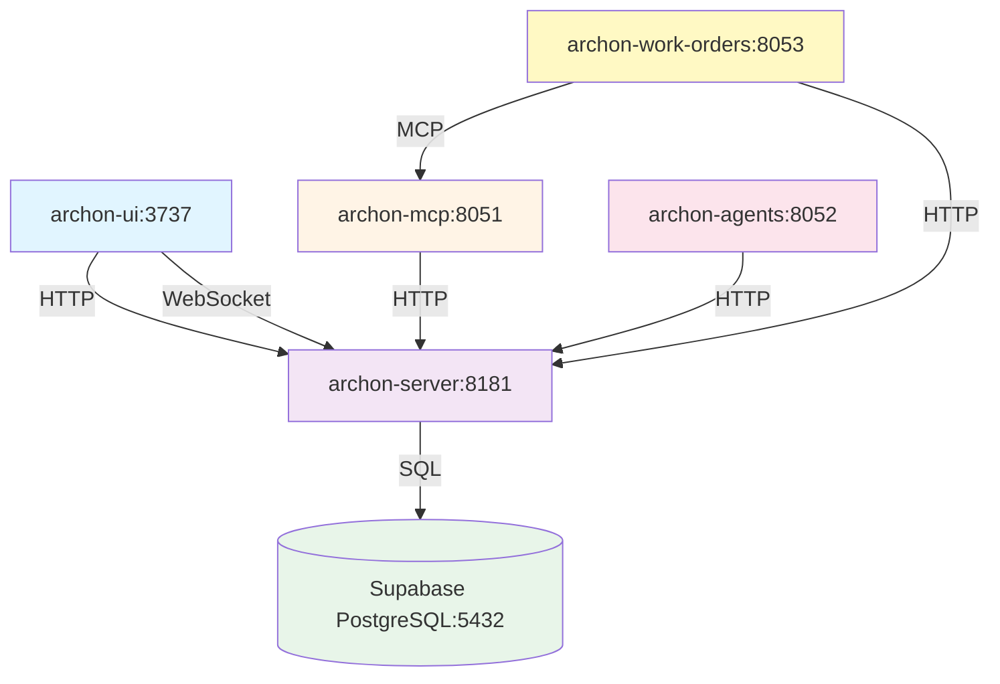

# Archon Improvement Project - MCP Creation Prompt

**Purpose**: Ready-to-use prompt for creating the Archon Q1 2025 Improvement Project via Archon MCP tools
**Version**: 1.0.0
**Date**: 2025-12-21
**Reference**: See IMPROVEMENT_STRATEGY_2025Q1.md for detailed analysis

---

## Quick Start

Copy the sections below and use them with Archon MCP tools to create the complete improvement project.

---

## Step 1: Create the Project

Use this with `manage_project("create", ...)`:

**Project Title**: Archon Q1 2025 Improvement Initiative

**Project Description**:
```
Comprehensive improvement initiative to elevate Archon from 7.2/10 to 8.5+/10 overall health score through security hardening, code quality improvements, testing infrastructure, and production readiness enhancements.

CRITICAL OBJECTIVES:
1. Security Hardening - Fix CORS vulnerability, add rate limiting, implement API authentication
2. Test Coverage Excellence - Re-enable frontend tests, achieve 70%+ coverage, add E2E tests
3. Code Maintainability - Refactor files >500 lines, address technical debt
4. Operational Resilience - Circuit breakers, automated migrations, enhanced monitoring

TIMELINE: 8 weeks (4 sprints)
ESTIMATED EFFORT: 120-160 hours
TARGET OUTCOME: Production-ready, enterprise-grade knowledge base and MCP server

See docs/IMPROVEMENT_STRATEGY_2025Q1.md for complete analysis and roadmap.
```

**GitHub Repo**: https://github.com/yourusername/archon (update with actual repo URL)

---

## Step 2: Create Sprint 1 Tasks (Critical Security & Stability)

Use `manage_task("create", project_id="<project-id>", ...)` for each task below:

### Task 1.1: Fix CORS Configuration

**Title**: Fix CORS security vulnerability

**Description**:
```
CRITICAL SECURITY FIX

Current Issue:
- File: python/src/server/main.py lines 172-178
- Problem: allow_origins=["*"] allows all origins in production
- CVSS Score: 7.5 (High)
- Risk: CSRF attacks, unauthorized cross-origin requests

Required Changes:
1. Update main.py to use environment-based origin whitelist
2. Add ALLOWED_ORIGINS to .env.example
3. Update docker-compose.yml with ALLOWED_ORIGINS env var
4. Test with multiple allowed origins
5. Document in INSTALLATION.md

Implementation:
```python
allowed_origins = os.getenv("ALLOWED_ORIGINS", "http://localhost:3737").split(",")
app.add_middleware(
    CORSMiddleware,
    allow_origins=allowed_origins,
    allow_credentials=True,
    allow_methods=["GET", "POST", "PUT", "DELETE", "OPTIONS"],
    allow_headers=["Content-Type", "Authorization", "X-API-Key"],
    max_age=3600,
)
```

Acceptance Criteria:
- [ ] CORS configured via ALLOWED_ORIGINS environment variable
- [ ] .env.example updated with example origins
- [ ] Docker Compose passes environment variable
- [ ] Tests verify CORS behavior with allowed/disallowed origins
- [ ] Documentation updated
- [ ] No existing integrations broken

Estimated Effort: 30 minutes
```

**Status**: todo
**Feature**: security
**Task Order**: 100 (highest priority)

### Task 1.2: Add Rate Limiting to MCP Server

**Title**: Add rate limiting to MCP server endpoints

**Description**:
```
CRITICAL SECURITY FIX

Current Issue:
- File: python/src/mcp_server/mcp_server.py
- Problem: No rate limiting on public MCP endpoints
- Risk: DoS attacks, resource exhaustion
- CVSS Score: 6.5 (Medium)

Required Changes:
1. Add slowapi dependency to pyproject.toml
2. Implement rate limiting middleware in mcp_server.py
3. Configure per-endpoint rate limits
4. Add RATE_LIMIT_PER_MINUTE to environment variables
5. Add tests for rate limit behavior
6. Document rate limits in API documentation

Implementation:
```python
from slowapi import Limiter, _rate_limit_exceeded_handler
from slowapi.util import get_remote_address
from slowapi.errors import RateLimitExceeded

limiter = Limiter(
    key_func=get_remote_address,
    default_limits=[os.getenv("RATE_LIMIT_PER_MINUTE", "100") + "/minute"]
)

app.state.limiter = limiter
app.add_exception_handler(RateLimitExceeded, _rate_limit_exceeded_handler)

# Per-endpoint limits
@app.post("/mcp")
@limiter.limit("100/minute")
async def handle_mcp_request(...):
    ...
```

Acceptance Criteria:
- [ ] slowapi installed and configured
- [ ] Rate limiting active on all public endpoints
- [ ] Default limit: 100 requests/minute (configurable)
- [ ] Proper HTTP 429 responses with Retry-After header
- [ ] Tests verify rate limit enforcement
- [ ] Documentation updated with rate limits

Estimated Effort: 2 hours
```

**Status**: todo
**Feature**: security
**Task Order**: 99

### Task 1.3: Add Rate Limiting to Backend API

**Title**: Add rate limiting to backend API endpoints

**Description**:
```
CRITICAL SECURITY FIX

Current Issue:
- File: python/src/server/main.py
- Problem: No rate limiting on backend API endpoints
- Risk: DoS attacks, resource exhaustion

Required Changes:
1. Add slowapi middleware to main.py (similar to MCP server)
2. Configure per-endpoint rate limits based on operation cost
3. Higher limits for read operations, lower for write operations
4. Add monitoring for rate limit hits

Endpoint-Specific Limits:
- GET endpoints: 200/minute
- POST/PUT/DELETE endpoints: 100/minute
- Heavy operations (crawl, process): 20/minute

Acceptance Criteria:
- [ ] Rate limiting active on all API endpoints
- [ ] Differentiated limits by operation type
- [ ] Monitoring alerts for rate limit violations
- [ ] Tests verify rate limit behavior
- [ ] Documentation includes rate limits per endpoint

Estimated Effort: 1 hour
```

**Status**: todo
**Feature**: security
**Task Order**: 98

### Task 1.4: Re-enable Frontend Tests in CI

**Title**: Re-enable frontend tests in CI/CD pipeline

**Description**:
```
CRITICAL QUALITY GATE

Current Issue:
- File: .github/workflows/ci.yml lines 42-72
- Problem: All frontend tests commented out (ESLint, TypeScript, Vitest)
- Risk: No quality gates for frontend code

Required Changes:
1. Uncomment ESLint step (line 42-44)
2. Uncomment TypeScript type check (line 46-48)
3. Uncomment Vitest tests with coverage (line 50-52)
4. Fix any linting errors that arise
5. Fix any type errors that arise
6. Ensure all tests pass

Steps:
1. Run locally first: npm run lint && npx tsc --noEmit && npm run test
2. Fix all errors locally
3. Uncomment CI steps
4. Verify CI pipeline passes
5. Update CONTRIBUTING.md with quality requirements

Acceptance Criteria:
- [ ] ESLint running in CI (no errors)
- [ ] TypeScript type check running in CI (no errors)
- [ ] Vitest tests running in CI (all passing)
- [ ] CI fails on frontend quality issues
- [ ] Documentation updated

Estimated Effort: 4-8 hours (depending on number of issues to fix)
```

**Status**: todo
**Feature**: ci-cd
**Task Order**: 97

### Task 1.5: Make Linting Blocking in CI

**Title**: Make linting and type checking blocking in CI

**Description**:
```
HIGH PRIORITY QUALITY GATE

Current Issue:
- File: .github/workflows/ci.yml lines 99-117
- Problem: continue-on-error: true allows linting failures
- Risk: Code quality degradation over time

Required Changes:
1. Fix all existing Ruff linting errors
2. Fix all existing MyPy type errors
3. Remove continue-on-error: true from Ruff step (line 107)
4. Remove continue-on-error: true from MyPy step (line 117)
5. Add linting to pre-commit hooks

Steps:
1. Run: make lint (fix all errors)
2. Run: make type-check (fix all errors)
3. Update ci.yml to remove continue-on-error
4. Set up pre-commit hooks for local development
5. Document in CONTRIBUTING.md

Acceptance Criteria:
- [ ] All Ruff linting errors fixed
- [ ] All MyPy type errors fixed
- [ ] CI fails on linting/type errors (no continue-on-error)
- [ ] Pre-commit hooks installed locally
- [ ] Documentation updated

Estimated Effort: 4 hours
```

**Status**: todo
**Feature**: ci-cd
**Task Order**: 96

### Task 1.6: Add Pre-commit Hooks

**Title**: Add pre-commit hooks for local quality checks

**Description**:
```
HIGH PRIORITY DEVELOPER EXPERIENCE

Objective: Catch quality issues before pushing to CI

Required Changes:
1. Add pre-commit framework to project
2. Configure hooks: Ruff, MyPy, ESLint, TypeScript, Prettier
3. Add installation instructions to README.md
4. Configure auto-fix where possible

.pre-commit-config.yaml:
```yaml
repos:
  - repo: local
    hooks:
      - id: ruff
        name: Ruff
        entry: ruff check
        language: system
        types: [python]
        pass_filenames: false

      - id: mypy
        name: MyPy
        entry: mypy
        language: system
        types: [python]
        pass_filenames: false

      - id: eslint
        name: ESLint
        entry: npm run lint
        language: system
        types: [javascript, jsx, ts, tsx]
        pass_filenames: false
```

Acceptance Criteria:
- [ ] Pre-commit framework installed
- [ ] Hooks configured for Python and TypeScript
- [ ] README.md includes setup instructions
- [ ] Hooks run automatically on git commit
- [ ] Documentation includes bypass instructions for emergencies

Estimated Effort: 2 hours
```

**Status**: todo
**Feature**: developer-experience
**Task Order**: 95

---

## Step 3: Create Sprint 2 Tasks (Code Quality & Testing)

### Task 2.1: Refactor code_extraction_service.py

**Title**: Refactor code_extraction_service.py (1781 lines → <500 lines)

**Description**:
```
HIGH PRIORITY CODE QUALITY

Current Issue:
- File: python/src/server/services/crawling/code_extraction_service.py
- Size: 1781 lines (3.5x recommended maximum)
- Problem: Too complex, hard to maintain, difficult to test

Refactoring Plan:
Split into focused modules:

1. code_extraction_service.py (300 lines)
   - Main orchestrator
   - Public API
   - Coordination logic

2. extractors/python_extractor.py (400 lines)
   - Python-specific AST parsing
   - Function/class extraction

3. extractors/typescript_extractor.py (350 lines)
   - TypeScript/JavaScript AST parsing
   - Function/class extraction

4. extractors/generic_extractor.py (250 lines)
   - Fallback for other languages
   - Pattern-based extraction

5. processors/ast_processor.py (300 lines)
   - AST processing utilities
   - Symbol resolution

6. processors/summary_processor.py (200 lines)
   - Code summarization
   - Documentation extraction

Steps:
1. Create new directory structure
2. Move extractors to separate modules
3. Move processors to separate modules
4. Update imports across codebase
5. Run full test suite (must maintain 100% pass rate)
6. Update documentation

Acceptance Criteria:
- [ ] Original file split into 6 focused modules
- [ ] All modules <500 lines
- [ ] All tests passing (zero regressions)
- [ ] Test coverage maintained or improved
- [ ] Import paths updated across codebase
- [ ] Documentation updated

Estimated Effort: 8-12 hours
```

**Status**: todo
**Feature**: code-quality
**Task Order**: 85

### Task 2.2: Refactor projects_api.py

**Title**: Refactor projects_api.py (1669 lines → <300 lines)

**Description**:
```
HIGH PRIORITY CODE QUALITY

Current Issue:
- File: python/src/server/api_routes/projects_api.py
- Size: 1669 lines
- Problem: API routes mixed with business logic

Refactoring Plan:

1. projects_api.py (300 lines)
   - FastAPI route definitions only
   - Request/response models
   - Validation

2. services/project_service.py (500 lines)
   - Core project business logic
   - CRUD operations
   - Status management

3. services/task_service.py (400 lines)
   - Task management logic
   - Task history tracking
   - Completion statistics

4. services/document_service.py (350 lines)
   - Document management
   - Version control
   - Tagging

Steps:
1. Create service layer modules
2. Move business logic from API routes to services
3. Update API routes to call services
4. Ensure proper error handling
5. Run integration tests
6. Update OpenAPI docs

Acceptance Criteria:
- [ ] API routes file <300 lines (routes only)
- [ ] Business logic in dedicated service modules
- [ ] All tests passing
- [ ] No performance degradation
- [ ] OpenAPI docs accurate
- [ ] Documentation updated

Estimated Effort: 6-8 hours
```

**Status**: todo
**Feature**: code-quality
**Task Order**: 84

### Task 2.3: Extract Shared Optimistic Update Logic

**Title**: Extract shared optimistic update logic into reusable hook

**Description**:
```
MEDIUM PRIORITY CODE QUALITY (DRY Violation)

Current Issue:
- File: archon-ui-main/src/features/knowledge/hooks/useKnowledgeQueries.ts
- Lines: 116-198 vs 318-410
- Problem: Near-identical optimistic update logic for crawl vs upload

Refactoring Plan:

1. Create useOptimisticMutation hook:
```typescript
// hooks/useOptimisticMutation.ts
export function useOptimisticMutation<TData, TVariables>({
  mutationFn,
  optimisticUpdater,
  successUpdater,
  queryKey,
}: OptimisticMutationOptions<TData, TVariables>) {
  const queryClient = useQueryClient();

  return useMutation({
    mutationFn,
    onMutate: async (variables) => {
      await queryClient.cancelQueries({ queryKey });
      const previousData = queryClient.getQueryData(queryKey);
      queryClient.setQueryData(queryKey, (old) =>
        optimisticUpdater(old, variables)
      );
      return { previousData };
    },
    onError: (err, variables, context) => {
      queryClient.setQueryData(queryKey, context.previousData);
    },
    onSuccess: (data, variables) => {
      queryClient.setQueryData(queryKey, (old) =>
        successUpdater(old, data, variables)
      );
    },
  });
}
```

2. Refactor useKnowledgeQueries to use shared hook
3. Add comprehensive tests for shared hook
4. Update documentation

Acceptance Criteria:
- [ ] useOptimisticMutation hook created
- [ ] Crawl mutation refactored to use shared hook
- [ ] Upload mutation refactored to use shared hook
- [ ] Code duplication eliminated (DRY)
- [ ] Tests cover all optimistic update scenarios
- [ ] Hook is reusable across features

Estimated Effort: 4-6 hours
```

**Status**: todo
**Feature**: code-quality
**Task Order**: 83

### Task 2.4: Add E2E Test Framework

**Title**: Add E2E test framework with Playwright

**Description**:
```
HIGH PRIORITY TESTING

Current Issue:
- No E2E tests exist
- Critical user flows untested
- Risk: Regressions in production workflows

Required Changes:

1. Install Playwright:
```bash
npm install -D @playwright/test
npx playwright install
```

2. Configure playwright.config.ts:
```typescript
export default defineConfig({
  testDir: './e2e',
  fullyParallel: true,
  forbidOnly: !!process.env.CI,
  retries: process.env.CI ? 2 : 0,
  workers: process.env.CI ? 1 : undefined,
  use: {
    baseURL: 'http://localhost:3737',
    trace: 'on-first-retry',
  },
  projects: [
    { name: 'chromium', use: { ...devices['Desktop Chrome'] } },
  ],
  webServer: {
    command: 'npm run dev',
    port: 3737,
    reuseExistingServer: !process.env.CI,
  },
});
```

3. Create E2E tests for 3 critical flows:
   - Knowledge crawl workflow
   - Task management workflow
   - Document upload workflow

Acceptance Criteria:
- [ ] Playwright installed and configured
- [ ] 3 critical user flows have E2E tests
- [ ] Tests run in CI pipeline
- [ ] Tests pass consistently (>95% success rate)
- [ ] Test reports generated
- [ ] README.md includes E2E test instructions

Estimated Effort: 8 hours (setup + 3 flows)
```

**Status**: todo
**Feature**: testing
**Task Order**: 82

### Task 2.5: Enforce Test Coverage Thresholds

**Title**: Enforce minimum test coverage thresholds in CI

**Description**:
```
MEDIUM PRIORITY TESTING

Current Issue:
- Coverage reported but not enforced
- No minimum coverage requirements
- Risk: Coverage degradation over time

Required Changes:

1. Backend (pytest):
```ini
# pytest.ini
[tool:pytest]
addopts = --cov --cov-report=html --cov-report=term --cov-fail-under=70
```

2. Frontend (Vitest):
```typescript
// vitest.config.ts
export default defineConfig({
  test: {
    coverage: {
      provider: 'v8',
      reporter: ['text', 'html', 'lcov'],
      statements: 70,
      branches: 70,
      functions: 70,
      lines: 70,
    },
  },
});
```

3. Update CI to enforce thresholds
4. Document coverage requirements in CONTRIBUTING.md

Acceptance Criteria:
- [ ] Backend coverage threshold: 70%
- [ ] Frontend coverage threshold: 70%
- [ ] CI fails if coverage below threshold
- [ ] Coverage reports in HTML format
- [ ] Coverage badges in README.md
- [ ] Documentation updated

Estimated Effort: 2 hours
```

**Status**: todo
**Feature**: testing
**Task Order**: 81

### Task 2.6: Add Integration Test Database Seeding

**Title**: Add integration test database seeding scripts

**Description**:
```
MEDIUM PRIORITY TESTING

Current Issue:
- Integration tests may require actual database
- No standardized test data
- Tests may interfere with each other

Required Changes:

1. Create test database seeding scripts:
```python
# tests/fixtures/db_seed.py
async def seed_test_database():
    """Seed test database with predictable data"""
    async with AsyncSession() as session:
        # Create test projects
        test_project = Project(
            id="test-project-1",
            title="Test Project",
            description="For integration tests"
        )
        session.add(test_project)

        # Create test tasks
        test_task = Task(
            id="test-task-1",
            project_id="test-project-1",
            title="Test Task",
            status="todo"
        )
        session.add(test_task)

        await session.commit()

async def cleanup_test_database():
    """Clean up test data"""
    async with AsyncSession() as session:
        await session.execute(delete(Task).where(Task.id.startswith("test-")))
        await session.execute(delete(Project).where(Project.id.startswith("test-")))
        await session.commit()
```

2. Use pytest fixtures for setup/teardown:
```python
@pytest.fixture(scope="function")
async def seeded_db():
    await seed_test_database()
    yield
    await cleanup_test_database()
```

3. Document test data patterns in TESTING_GUIDE.md

Acceptance Criteria:
- [ ] Database seeding scripts created
- [ ] Pytest fixtures for setup/teardown
- [ ] Test data uses "test-" prefix for easy identification
- [ ] Integration tests run in isolation
- [ ] No interference between test runs
- [ ] Documentation updated

Estimated Effort: 4 hours
```

**Status**: todo
**Feature**: testing
**Task Order**: 80

---

## Step 4: Create Sprint 3 Tasks (Production Readiness)

### Task 3.1: Implement API Authentication

**Title**: Implement API key authentication for production

**Description**:
```
HIGH PRIORITY SECURITY

Current Issue:
- Endpoints publicly accessible
- No authentication layer
- Risk: Unauthorized access, data leakage

Required Changes:

1. Add API key middleware:
```python
# middleware/auth.py
from fastapi import Security, HTTPException, status
from fastapi.security.api_key import APIKeyHeader

api_key_header = APIKeyHeader(name="X-API-Key", auto_error=False)

async def verify_api_key(api_key: str = Security(api_key_header)):
    """Verify API key from header"""
    if not api_key:
        if os.getenv("ENVIRONMENT") == "production":
            raise HTTPException(
                status_code=status.HTTP_403_FORBIDDEN,
                detail="API key required"
            )
        return  # Allow in development

    valid_key = os.getenv("API_KEY")
    if api_key != valid_key:
        raise HTTPException(
            status_code=status.HTTP_403_FORBIDDEN,
            detail="Invalid API key"
        )
```

2. Apply to endpoints:
```python
@app.get("/api/projects", dependencies=[Depends(verify_api_key)])
async def get_projects():
    ...
```

3. Add to MCP server as well
4. Update client code to include API key
5. Document authentication in API docs

Acceptance Criteria:
- [ ] API key authentication middleware implemented
- [ ] All API endpoints protected (except health check)
- [ ] MCP endpoints protected
- [ ] Client code updated with API key header
- [ ] Tests include authentication scenarios
- [ ] Documentation includes authentication guide
- [ ] Grace period for migration (warning mode before enforcement)

Estimated Effort: 6 hours
```

**Status**: todo
**Feature**: security
**Task Order**: 75

### Task 3.2: Add Circuit Breaker Pattern

**Title**: Implement circuit breaker for service resilience

**Description**:
```
MEDIUM PRIORITY ARCHITECTURE

Current Issue:
- No circuit breaker for dependent services
- Failed dependencies cause cascading failures
- No graceful degradation

Required Changes:

1. Install pybreaker:
```bash
uv pip install pybreaker
```

2. Configure circuit breakers:
```python
# services/circuit_breakers.py
from pybreaker import CircuitBreaker

# Circuit breaker for archon-server
archon_server_breaker = CircuitBreaker(
    fail_max=5,  # Open after 5 failures
    timeout_duration=60,  # Try again after 60 seconds
    name="archon-server"
)

# Circuit breaker for Supabase
supabase_breaker = CircuitBreaker(
    fail_max=3,
    timeout_duration=30,
    name="supabase"
)

@supabase_breaker
async def query_database(query: str):
    """Database query with circuit breaker"""
    # ... database logic
```

3. Add fallback behaviors for open circuits
4. Monitor circuit breaker state
5. Add alerts for circuit breaker events

Acceptance Criteria:
- [ ] Circuit breakers for archon-server, Supabase
- [ ] Graceful degradation when circuit open
- [ ] Monitoring dashboard shows circuit state
- [ ] Alerts configured for circuit open events
- [ ] Tests verify circuit breaker behavior
- [ ] Documentation includes runbook for circuit breaker events

Estimated Effort: 8 hours
```

**Status**: todo
**Feature**: architecture
**Task Order**: 74

### Task 3.3: Create Automated Migration Runner

**Title**: Create automated database migration runner

**Description**:
```
MEDIUM PRIORITY OPERATIONS

Current Issue:
- Manual SQL execution in Supabase dashboard
- Error-prone migration process
- No rollback mechanism

Required Changes:

1. Create migration runner CLI:
```python
# scripts/migrate.py
import asyncio
from pathlib import Path
import asyncpg

async def run_migrations(direction="up"):
    """Run database migrations"""
    conn = await asyncpg.connect(os.getenv("DATABASE_URL"))

    # Create migrations table
    await conn.execute("""
        CREATE TABLE IF NOT EXISTS schema_migrations (
            version VARCHAR(255) PRIMARY KEY,
            applied_at TIMESTAMP DEFAULT NOW()
        )
    """)

    # Get applied migrations
    applied = await conn.fetch("SELECT version FROM schema_migrations")
    applied_versions = {row['version'] for row in applied}

    # Find migration files
    migration_dir = Path("migration")
    for version_dir in sorted(migration_dir.iterdir()):
        for migration_file in sorted(version_dir.glob("*.sql")):
            version = f"{version_dir.name}/{migration_file.stem}"

            if direction == "up" and version not in applied_versions:
                print(f"Applying {version}...")
                sql = migration_file.read_text()
                await conn.execute(sql)
                await conn.execute(
                    "INSERT INTO schema_migrations (version) VALUES ($1)",
                    version
                )
            elif direction == "down" and version in applied_versions:
                # Rollback logic
                pass

    await conn.close()

if __name__ == "__main__":
    asyncio.run(run_migrations())
```

2. Add to Makefile:
```makefile
migrate:
	uv run python scripts/migrate.py
```

3. Add to Docker entrypoint for automated migrations
4. Document migration process

Acceptance Criteria:
- [ ] Migration runner CLI created
- [ ] Migrations run via `make migrate`
- [ ] Migration history tracked in database
- [ ] Rollback capability implemented
- [ ] Docker containers run migrations on startup
- [ ] Documentation includes migration guide

Estimated Effort: 6 hours
```

**Status**: todo
**Feature**: operations
**Task Order**: 73

### Task 3.4: Enhance API Documentation

**Title**: Enhance API documentation with FastAPI /docs

**Description**:
```
LOW PRIORITY DOCUMENTATION

Objective: Ensure API documentation is accessible and comprehensive

Required Changes:

1. Verify FastAPI /docs endpoint is accessible:
```python
# main.py
app = FastAPI(
    title="Archon Knowledge API",
    description="REST API for Archon knowledge base and project management",
    version="0.2.0",
    docs_url="/docs",
    redoc_url="/redoc",
)
```

2. Enhance API models with examples:
```python
class ProjectCreate(BaseModel):
    title: str = Field(..., example="Q1 2025 Improvement Initiative")
    description: str = Field(..., example="Comprehensive improvement project...")
    github_repo: Optional[str] = Field(None, example="https://github.com/user/archon")
```

3. Add endpoint descriptions:
```python
@app.post("/api/projects", response_model=Project)
async def create_project(project: ProjectCreate):
    """
    Create a new project

    This endpoint creates a new project in the Archon system.

    **Required Fields:**
    - title: Project name
    - description: Project goals and scope

    **Optional Fields:**
    - github_repo: GitHub repository URL
    """
    ...
```

4. Create API changelog document
5. Document in README.md: "API docs available at http://localhost:8181/docs"

Acceptance Criteria:
- [ ] FastAPI /docs accessible at http://localhost:8181/docs
- [ ] All models have example values
- [ ] All endpoints have descriptions
- [ ] API changelog created
- [ ] README.md includes API docs link

Estimated Effort: 2 hours
```

**Status**: todo
**Feature**: documentation
**Task Order**: 72

### Task 3.5: Add Database Query Performance Monitoring

**Title**: Add slow query logging and monitoring

**Description**:
```
MEDIUM PRIORITY PERFORMANCE

Current Issue:
- No visibility into slow database queries
- Potential N+1 queries undetected
- No performance benchmarks

Required Changes:

1. Add slow query logging:
```python
# database.py
import logging
import time
from sqlalchemy import event
from sqlalchemy.engine import Engine

logger = logging.getLogger(__name__)

@event.listens_for(Engine, "before_cursor_execute")
def before_cursor_execute(conn, cursor, statement, parameters, context, executemany):
    conn.info.setdefault('query_start_time', []).append(time.time())

@event.listens_for(Engine, "after_cursor_execute")
def after_cursor_execute(conn, cursor, statement, parameters, context, executemany):
    total = time.time() - conn.info['query_start_time'].pop(-1)

    if total > 0.1:  # Log queries >100ms
        logger.warning(
            f"Slow query ({total:.3f}s): {statement[:200]}",
            extra={
                "duration_seconds": total,
                "query": statement,
                "correlation_id": context.get("correlation_id"),
            }
        )
```

2. Add query count tracking per request
3. Create performance monitoring dashboard
4. Set up alerts for slow queries

Acceptance Criteria:
- [ ] Slow queries (>100ms) logged with correlation IDs
- [ ] Query count tracked per request
- [ ] Grafana dashboard for query performance
- [ ] Alerts for queries >500ms
- [ ] Documentation includes performance tuning guide

Estimated Effort: 4 hours
```

**Status**: todo
**Feature**: performance
**Task Order**: 71

### Task 3.6: Create Service Dependency Diagram

**Title**: Create comprehensive service dependency diagram

**Description**:
```
LOW PRIORITY DOCUMENTATION

Objective: Visualize service architecture and dependencies

Required Changes:

1. Create Mermaid diagram in ARCHITECTURE.md:


2. Add network topology diagram
3. Document failure modes:
   - What happens if Supabase is down?
   - What happens if archon-server is down?
   - Circuit breaker behavior
4. Add to ARCHITECTURE.md

Acceptance Criteria:
- [ ] Service dependency diagram in ARCHITECTURE.md
- [ ] Network topology documented
- [ ] Failure modes documented
- [ ] Recovery procedures documented
- [ ] Diagram reviewed by team

Estimated Effort: 2 hours
```

**Status**: todo
**Feature**: documentation
**Task Order**: 70

---

## Step 5: Create Sprint 4 Tasks (Technical Debt & Optimization)

### Task 4.1: Address High-Priority TODO/FIXME Markers

**Title**: Resolve high-priority TODO/FIXME markers

**Description**:
```
MEDIUM PRIORITY TECHNICAL DEBT

Current Issue:
- 123 files contain TODO/FIXME/HACK markers
- Technical debt accumulating
- Some TODOs are critical

Process:

1. Audit all TODO/FIXME markers:
```bash
grep -r "TODO\|FIXME\|HACK" --include="*.py" --include="*.ts" python/ archon-ui-main/ > todos.txt
```

2. Categorize by priority:
   - CRITICAL: Security, data loss, crashes
   - HIGH: Performance, user experience
   - MEDIUM: Code quality, maintainability
   - LOW: Nice-to-have improvements

3. Create Archon task for each CRITICAL and HIGH item
4. Resolve ~30 high-priority items in this sprint
5. Document remaining items in TECHNICAL_DEBT.md

Example High-Priority TODO:
```typescript
// useKnowledgeQueries.ts lines 122-138
// TODO: Fix invisible optimistic updates
// ISSUE: Optimistic updates only work if filter matches current view
// PROPER FIX requires: KnowledgeFilterContext or prop drilling
```

Acceptance Criteria:
- [ ] All TODOs catalogued and prioritized
- [ ] CRITICAL TODOs resolved (security, data loss)
- [ ] 30+ HIGH priority TODOs resolved
- [ ] Remaining TODOs tracked in Archon tasks
- [ ] TECHNICAL_DEBT.md created with roadmap

Estimated Effort: 16 hours
```

**Status**: todo
**Feature**: technical-debt
**Task Order**: 65

### Task 4.2: Implement KnowledgeFilterContext

**Title**: Fix optimistic update visibility issue with KnowledgeFilterContext

**Description**:
```
MEDIUM PRIORITY UX IMPROVEMENT

Current Issue:
- File: archon-ui-main/src/features/knowledge/hooks/useKnowledgeQueries.ts lines 122-138
- Problem: Optimistic updates only visible if filter matches current view
- Impact: Users don't see immediate feedback when adding knowledge items

Solution: Implement React Context for filter state

1. Create KnowledgeFilterContext:
```typescript
// features/knowledge/context/KnowledgeFilterContext.tsx
export const KnowledgeFilterContext = createContext<{
  currentFilter: KnowledgeFilter;
  setFilter: (filter: KnowledgeFilter) => void;
}>({
  currentFilter: { status: 'all', source: null },
  setFilter: () => {},
});

export function KnowledgeFilterProvider({ children }) {
  const [currentFilter, setFilter] = useState<KnowledgeFilter>({
    status: 'all',
    source: null,
  });

  return (
    <KnowledgeFilterContext.Provider value={{ currentFilter, setFilter }}>
      {children}
    </KnowledgeFilterContext.Provider>
  );
}
```

2. Update optimistic update logic to use context:
```typescript
const { currentFilter } = useContext(KnowledgeFilterContext);

onMutate: async (variables) => {
  // Always show optimistic update, regardless of filter
  // Mark as "pending" and update when confirmed
}
```

3. Add tests for filter context
4. Document pattern in DATA_FETCHING_ARCHITECTURE.md

Acceptance Criteria:
- [ ] KnowledgeFilterContext created
- [ ] Optimistic updates visible in all filter states
- [ ] Tests cover filter context behavior
- [ ] No regressions in existing functionality
- [ ] Documentation updated

Estimated Effort: 6 hours
```

**Status**: todo
**Feature**: ux-improvement
**Task Order**: 64

### Task 4.3: Refactor code_storage_service.py

**Title**: Refactor code_storage_service.py (1433 lines → <500 lines)

**Description**:
```
MEDIUM PRIORITY CODE QUALITY

Current Issue:
- File: python/src/server/services/storage/code_storage_service.py
- Size: 1433 lines
- Problem: Storage and retrieval concerns mixed

Refactoring Plan:

1. code_storage_service.py (300 lines)
   - Main orchestrator
   - Public API

2. storage/writer_service.py (500 lines)
   - Write operations
   - Batch inserts
   - Transaction management

3. storage/reader_service.py (400 lines)
   - Read operations
   - Query optimization
   - Caching

4. storage/search_service.py (250 lines)
   - Vector search
   - Full-text search
   - Hybrid search

Steps:
1. Create new service modules
2. Move storage logic to writer_service
3. Move retrieval logic to reader_service
4. Move search logic to search_service
5. Update imports
6. Run tests

Acceptance Criteria:
- [ ] Original file split into focused services
- [ ] All modules <500 lines
- [ ] Clear separation: write/read/search
- [ ] All tests passing
- [ ] No performance degradation
- [ ] Documentation updated

Estimated Effort: 6 hours
```

**Status**: todo
**Feature**: code-quality
**Task Order**: 63

### Task 4.4: Add Frontend Bundle Analysis

**Title**: Add frontend bundle size analysis

**Description**:
```
LOW PRIORITY PERFORMANCE

Objective: Gain visibility into frontend bundle size

Required Changes:

1. Install bundle analyzer:
```bash
npm install -D vite-bundle-visualizer
```

2. Add to package.json:
```json
{
  "scripts": {
    "analyze": "vite-bundle-visualizer"
  }
}
```

3. Add to CI pipeline:
```yaml
- name: Analyze bundle size
  run: npm run build && npm run analyze

- name: Check bundle size
  run: |
    BUNDLE_SIZE=$(du -k dist/assets/*.js | awk '{total+=$1} END {print total}')
    if [ $BUNDLE_SIZE -gt 500 ]; then
      echo "Bundle size ${BUNDLE_SIZE}KB exceeds 500KB limit"
      exit 1
    fi
```

4. Document bundle size in build output
5. Set performance budgets

Acceptance Criteria:
- [ ] vite-bundle-visualizer installed
- [ ] Bundle analysis runs via `npm run analyze`
- [ ] CI checks bundle size (<500KB)
- [ ] Bundle size visible in build output
- [ ] Performance budgets documented

Estimated Effort: 2 hours
```

**Status**: todo
**Feature**: performance
**Task Order**: 62

### Task 4.5: Implement Route-Based Code Splitting

**Title**: Implement route-based code splitting

**Description**:
```
LOW PRIORITY PERFORMANCE

Objective: Reduce initial bundle size via code splitting

Required Changes:

1. Lazy load feature routes:
```typescript
// App.tsx
import { lazy, Suspense } from 'react';

const KnowledgePage = lazy(() => import('./features/knowledge/KnowledgePage'));
const ProjectsPage = lazy(() => import('./features/projects/ProjectsPage'));
const TasksPage = lazy(() => import('./features/tasks/TasksPage'));

function App() {
  return (
    <Suspense fallback={<LoadingSpinner />}>
      <Routes>
        <Route path="/knowledge" element={<KnowledgePage />} />
        <Route path="/projects" element={<ProjectsPage />} />
        <Route path="/tasks" element={<TasksPage />} />
      </Routes>
    </Suspense>
  );
}
```

2. Add loading states
3. Preload critical routes
4. Measure bundle size reduction

Acceptance Criteria:
- [ ] Route-based code splitting implemented
- [ ] Initial bundle size reduced >20%
- [ ] Loading states for route transitions
- [ ] No regressions in user experience
- [ ] Bundle analysis shows separate chunks

Estimated Effort: 4 hours
```

**Status**: todo
**Feature**: performance
**Task Order**: 61

### Task 4.6: Separate RLS Policies for Read/Write

**Title**: Create granular RLS policies for read vs write operations

**Description**:
```
MEDIUM PRIORITY SECURITY

Current Issue:
- RLS policies are broad (allow all for authenticated)
- No distinction between read and write operations
- Could be more granular

Required Changes:

1. Create separate policies:
```sql
-- Read policies (more permissive)
CREATE POLICY "Allow authenticated users to read projects"
ON archon_projects
FOR SELECT
TO authenticated
USING (true);

-- Write policies (more restrictive)
CREATE POLICY "Allow authenticated users to insert own projects"
ON archon_projects
FOR INSERT
TO authenticated
WITH CHECK (created_by = auth.uid());

CREATE POLICY "Allow authenticated users to update own projects"
ON archon_projects
FOR UPDATE
TO authenticated
USING (created_by = auth.uid())
WITH CHECK (created_by = auth.uid());

-- Admin can do everything
CREATE POLICY "Allow service role full access"
ON archon_projects
TO service_role
USING (true)
WITH CHECK (true);
```

2. Apply to all Archon tables
3. Test with different user roles
4. Document RLS architecture

Acceptance Criteria:
- [ ] Separate RLS policies for SELECT, INSERT, UPDATE, DELETE
- [ ] Users can only modify own records
- [ ] Service role has full access
- [ ] Tests verify RLS enforcement
- [ ] Documentation includes RLS architecture

Estimated Effort: 3 hours
```

**Status**: todo
**Feature**: security
**Task Order**: 60

### Task 4.7: Make Indexes Required for Production

**Title**: Make optional indexes required for production

**Description**:
```
LOW PRIORITY PERFORMANCE

Current Issue:
- File: migration/0.1.0/006_ollama_create_indexes_optional.sql
- Name includes "_optional"
- May be skipped in production

Required Changes:

1. Rename migration file:
```bash
mv migration/0.1.0/006_ollama_create_indexes_optional.sql \
   migration/0.1.0/006_create_required_indexes.sql
```

2. Update migration documentation to mark as required
3. Add to production deployment checklist
4. Verify indexes exist in production database

Indexes to create:
```sql
-- Performance-critical indexes
CREATE INDEX IF NOT EXISTS idx_archon_knowledge_source_id
ON archon_knowledge_items(source_id);

CREATE INDEX IF NOT EXISTS idx_archon_tasks_project_id
ON archon_tasks(project_id);

CREATE INDEX IF NOT EXISTS idx_archon_tasks_status
ON archon_tasks(status);

-- Vector search indexes
CREATE INDEX ON archon_page_sections
USING ivfflat (embedding vector_cosine_ops)
WITH (lists = 100);
```

Acceptance Criteria:
- [ ] Migration file renamed (remove "_optional")
- [ ] Documentation marks indexes as required
- [ ] Production checklist includes index verification
- [ ] Indexes verified in production database

Estimated Effort: 1 hour
```

**Status**: todo
**Feature**: performance
**Task Order**: 59

---

## Step 6: Create Backlog Tasks (Future Iterations)

### Task B.1: Add Redis Caching Layer

**Title**: Add Redis caching for frequently accessed data

**Description**:
```
LOW PRIORITY PERFORMANCE (Backlog)

Use Case: Cache frequently accessed knowledge base queries

Implementation Plan:

1. Add Redis to docker-compose.yml:
```yaml
redis:
  image: redis:7-alpine
  ports:
    - "6379:6379"
  volumes:
    - redis_data:/data
```

2. Add caching decorator:
```python
from redis import asyncio as aioredis
import json

redis_client = aioredis.from_url("redis://localhost:6379")

def cache(ttl: int = 300):
    def decorator(func):
        async def wrapper(*args, **kwargs):
            cache_key = f"{func.__name__}:{hash((args, tuple(kwargs.items())))}"

            # Try cache first
            cached = await redis_client.get(cache_key)
            if cached:
                return json.loads(cached)

            # Call function
            result = await func(*args, **kwargs)

            # Cache result
            await redis_client.setex(
                cache_key,
                ttl,
                json.dumps(result)
            )

            return result
        return wrapper
    return decorator

@cache(ttl=600)
async def get_knowledge_items(source_id: str):
    # ... database query
```

3. Add cache invalidation on updates
4. Monitor cache hit rates

Estimated Effort: 8 hours
Expected Benefit: 30-50% faster for cached queries
```

**Status**: todo
**Feature**: performance
**Task Order**: 10

### Task B.2: Implement Webhook Notification System

**Title**: Add webhook notifications for events

**Description**:
```
LOW PRIORITY FEATURE (Backlog)

Use Case: Notify external systems of task completion, crawl completion

Implementation Plan:

1. Add webhook configuration to settings table:
```sql
CREATE TABLE archon_webhooks (
    id UUID PRIMARY KEY DEFAULT gen_random_uuid(),
    url TEXT NOT NULL,
    events TEXT[] NOT NULL,
    secret TEXT NOT NULL,
    active BOOLEAN DEFAULT true,
    created_at TIMESTAMP DEFAULT NOW()
);
```

2. Implement webhook dispatcher:
```python
import httpx
import hmac
import hashlib

async def dispatch_webhook(event: str, payload: dict):
    """Send webhook notifications"""
    webhooks = await get_active_webhooks(event)

    for webhook in webhooks:
        signature = hmac.new(
            webhook.secret.encode(),
            json.dumps(payload).encode(),
            hashlib.sha256
        ).hexdigest()

        async with httpx.AsyncClient() as client:
            await client.post(
                webhook.url,
                json=payload,
                headers={
                    "X-Webhook-Signature": signature,
                    "X-Webhook-Event": event,
                }
            )
```

3. Add webhook triggers for events:
   - task.completed
   - knowledge.crawl_completed
   - project.created

Estimated Effort: 12 hours
Expected Benefit: Better integration capabilities
```

**Status**: todo
**Feature**: integration
**Task Order**: 9

### Task B.3: Add Security Scanning to CI

**Title**: Add automated security scanning to CI/CD

**Description**:
```
MEDIUM PRIORITY SECURITY (Backlog)

Objective: Automated vulnerability detection

Implementation Plan:

1. Add Bandit for Python:
```yaml
# .github/workflows/ci.yml
- name: Run Bandit security scan
  run: |
    pip install bandit
    bandit -r python/ -f json -o bandit-report.json
```

2. Add npm audit for frontend:
```yaml
- name: Run npm audit
  run: npm audit --audit-level=high
```

3. Add Snyk or similar for dependency scanning
4. Configure alerts for critical vulnerabilities

Estimated Effort: 4 hours
Expected Benefit: Proactive vulnerability detection
```

**Status**: todo
**Feature**: security
**Task Order**: 8

---

## Summary

This prompt provides a complete, ready-to-execute plan for creating the Archon Q1 2025 Improvement Initiative as a project within Archon itself.

### Quick Stats

**Total Tasks**: 30+ tasks across 4 sprints + backlog
**Total Estimated Effort**: 120-160 hours
**Timeline**: 8 weeks (4 sprints of 2 weeks each)
**Priority Breakdown**:
- Critical: 3 tasks (security fixes)
- High: 11 tasks (code quality, testing, production readiness)
- Medium: 12 tasks (technical debt, optimizations)
- Low: 7 tasks (documentation, nice-to-have features)
- Backlog: 3 tasks (future enhancements)

### Execution Instructions

1. **Create the project** using Step 1 prompt with `manage_project("create", ...)`
2. **Create all tasks** sequentially using Step 2-6 prompts with `manage_task("create", project_id="<id>", ...)`
3. **Verify creation** with `find_tasks(project_id="<id>")`
4. **Begin Sprint 1** by updating first task to status="doing"

### Success Metrics

Track progress using Archon's own system:
- **Sprint Completion**: Percentage of sprint tasks completed
- **Overall Progress**: Completed tasks / Total tasks
- **Health Score Improvement**: Track from 7.2 to target 8.5+
- **Quality Metrics**: Test coverage, security score, code complexity

---

**Ready to Execute**: Copy the prompts above and use with Archon MCP tools to create the complete improvement project.

**Reference Documentation**: See docs/IMPROVEMENT_STRATEGY_2025Q1.md for detailed analysis and strategy.
